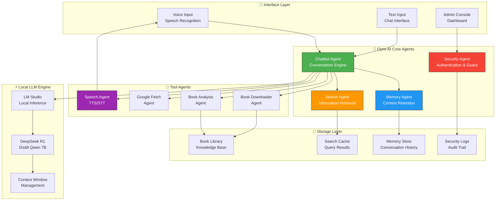
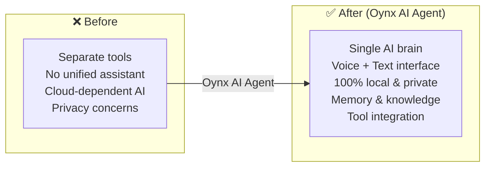

# 🧠 Oynx AI Brain — Autonomous Local AI Assistant Agent

> **A fully autonomous AI assistant agent running 100% locally with LM Studio**  
> Voice-enabled, memory-equipped, book-aware, security-hardened — your personal AI brain.

---

## 🧠 AI Agent Architecture



## 🤖 AI Agent Components

| Agent | Module | Function |
|-------|--------|----------|
| **Chatbot Agent** | `chatbot.py` | Core conversation engine — processes queries, routes to tools, maintains context |
| **Memory Agent** | `memory.py` | Maintains conversation history and user preferences across sessions |
| **Search Agent** | `search.py` | Retrieves information from local knowledge base and cached queries |
| **Security Agent** | `security.py`, `Admin.py` | Admin authentication, access control, audit logging |
| **Book Downloader Agent** | `book_downloader.py` | Downloads and catalogs books for knowledge expansion |
| **Book Analysis Agent** | `book_analysis.py` | Analyzes book content, extracts insights, builds knowledge |
| **Google Fetch Agent** | `fetch_google.py` | Retrieves information via Google Custom Search API |
| **Speech Agent** | `speech.py` | Text-to-Speech and Speech-to-Text for voice interaction |

## 🛠 Tech Stack

| Component | Technology | Agent Role |
|-----------|-----------|------------|
| **LLM Backend** | LM Studio (Local) | Local inference engine |
| **AI Model** | DeepSeek R1 Distill Qwen 7B | Core reasoning agent |
| **Voice** | Google Cloud TTS | Speech synthesis agent |
| **Fuzzy Matching** | RapidFuzz | Intent recognition agent |
| **Security** | Custom auth system | Access control agent |
| **Platform** | Windows 11 + RTX 3060 6GB | Local inference hardware |

## 🔄 Before vs After



## ⚡ Quick Start

```bash
# Start the Oynx AI Assistant
python chatbot.py

# Access admin dashboard
python Admin.py
```

## 📁 Repository Contents

| File | Description |
|------|-------------|
| `chatbot.py` | Core AI conversation agent |
| `Admin.py` | Admin authentication & dashboard |
| `memory.py` | Persistent memory & context agent |
| `search.py` | Knowledge retrieval agent |
| `speech.py` | Voice I/O agent |
| `security.py` | Access control agent |
| `book_downloader.py` | Book acquisition agent |
| `book_analysis.py` | Book insight extraction agent |
| `fetch_google.py` | Web intelligence agent |
| `config.py` | Configuration agent |

---

Built by **[Shazaly Musa](https://github.com/SparkSpheartech)** — Founder, SparkSphear Tech  
*AI Agents for Personal & Enterprise Local AI Assistants*